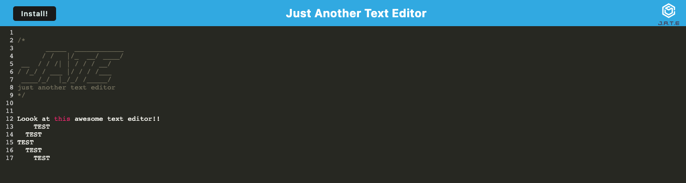

# text-editor

## Description

This application uses PWA principles to create a text editor that can work off line with a database that stores the users inputs and can be revisted.

## Table of Contents

The below is the table of contents

- [Installation](#installation)
- [Usage](#usage)
- [Credits](#credits)

## Installation

To install this please `NPM Install` followed by `NPM RUN START`, once used in a

## Usage

Below is a screen shot of the application in use.

The links to this application are below:
https://kgiunta.github.io/daily-meal-planner/  
https://github.com/kgiunta/daily-meal-planner/

## Credits

Below are the people who I collaborated with to complete this project:

Dominick Albano |https://github.com/dev-dominick  
Mike Fedele |https://github.com/Mikefedele  
Owen Foreman | https://github.com/owenforeman1
